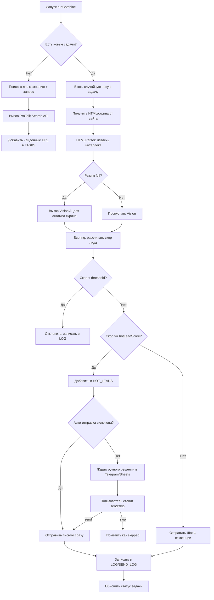

# ProTalk: AI-Driven Lead Scoring and Outreach Email in Google Sheet

**🔗 [Открыть шаблон Google Sheets](https://docs.google.com/spreadsheets/d/1Yium08q_ip4s3KePPgiD9slLA2xtDpqUs7oZKeZjZYg/edit?usp=sharing)**  
*Скопируйте таблицу себе (Файл → Создать копию) для начала работы.*

### 📸 Интерфейс Комбайна v4.0

<p align="center">
  
  
  
  
</p>

---

# 🤖 Комбайн v4.0 — Автоматизация холодных продаж

[](https://developers.google.com/apps-script)
[](https://pro-talk.ru)
[](https://core.telegram.org/bots)

> **Комбайн v4.0** — это мощный инструмент для автоматизации outbound-продаж на базе Google Sheets + Apps Script. Система самостоятельно ищет лиды, анализирует их сайты, оценивает перспективность и отправляет персонализированные письма с поддержкой AI, A/B-тестов и follow-up последовательностей.

---

## 📋 Оглавление

- [Возможности](#-возможности)
- [Архитектура проекта](#-архитектура-проекта)
- [Требования](#-требования)
- [Установка и настройка](#-установка-и-настройка)
- [Структура Google Sheets](#-структура-google-sheets)
- [Конфигурация](#-конфигурация)
- [Как это работает](#-как-это-работает)
- [Режимы генерации писем](#-режимы-генерации-писем)
- [Telegram-уведомления](#-telegram-уведомления)
- [Лимиты и квоты](#-лимиты-и-квоты)
- [Устранение неполадок](#-устранение-неполадок)
- [Безопасность](#-безопасность)
- [Contributing](#-contributing)
- [License](#-license)

---

## ✨ Возможности

### 🔍 Поиск и анализ лидов
- Поиск сайтов через Google Search API (ProTalk)
- Глубокий парсинг HTML: CMS, аналитика, контакты, адаптивность
- Скриншоты сайтов + Vision AI для визуальной оценки
- Извлечение email и телефонов с приоритизацией

### 🎯 Умный скоринг
- Базовая оценка по техническим сигналам
- Бонусы за отсутствие мобильной версии, старой CMS, устаревшего копирайта
- Интеграция с Vision AI для оценки дизайна
- Пороговые значения: `threshold` (отправка) и `hotLeadScore` (ручное решение)

### ✉️ Персонализированная рассылка
- Три режима генерации писем через AI:
  - `strict` — ИИ пишет только ледокол, оффер вставляется дословно
  - `rewrite` — ИИ адаптирует оффер под сайт, сохраняя ссылки и цифры
  - `full` — ИИ пишет всё письмо целиком по брифу
- A/B-тестирование промптов с автоматическим выбором победителя
- Поддержка follow-up последовательностей с задержками

### 🔥 Управление горячими лидами
- Автоматическая или ручная отправка для лидов с высоким скором
- Мгновенные уведомления в Telegram
- Простое управление через лист `🔥 HOT_LEADS`

### 🛡️ Защита и контроль
- Черный список доменов и email
- Кулдаун 90 дней на повторный контакт с доменом
- Лимиты по времени работы и количеству писем в день
- Режим отладки (`TEST_EMAIL`) и фейковой отправки (`FAKE_MAIL_SEND`)

### 📊 Логирование и аналитика
- Детальные логи в `📊 LOG` и `📤 SEND_LOG`
- Статистика A/B-тестов в `⚖️ AB_RESULTS`
- Уведомления о квотах Gmail

---

## 🗂️ Архитектура проекта

```
sale_combain/
├── Code.gs              # Точка входа: runCombine, процессинг задач
├── Campaigns.gs         # Управление кампаниями, запросами, секвенциями
├── HTMLParser.gs        # Парсинг HTML, извлечение контактов и метаданных
├── ProTalkAPI.gs        # Интеграция с ProTalk: поиск, скриншоты, Vision, AI Router
├── Scoring.gs           # Система скоринга лидов
├── Setup.gs             # Инициализация листов, меню, триггеров
├── Utils.gs             # Утилиты: конфиг, логи, Telegram, хелперы
└── (опционально) README.md
```

### Ключевые функции

| Файл | Функция | Описание |
|------|---------|----------|
| `Code.gs` | `runCombine()` | Главный цикл: поиск → анализ → скоринг → отправка |
| `Code.gs` | `processInitialTask()` | Обработка одной новой задачи |
| `Code.gs` | `sendSequenceStep()` | Отправка шага секвенции с генерацией письма |
| `Campaigns.gs` | `getActiveCampaigns()` | Получение активных кампаний из Sheets |
| `Campaigns.gs` | `selectVariant()` | Выбор варианта промпта для A/B-теста |
| `HTMLParser.gs` | `extractSiteIntelligence()` | Глубокий анализ HTML сайта |
| `ProTalkAPI.gs` | `callProTalkFunction()` | Вызов функций ProTalk с polling |
| `ProTalkAPI.gs` | `callAIRouter()` | Вызов AI-моделей через OpenRouter |
| `Scoring.gs` | `calculateLeadScore()` | Расчёт скоринга лида |
| `Utils.gs` | `sendTelegramNotification()` | Отправка уведомлений в Telegram |

---

## ⚙️ Требования

1. **Google аккаунт** с доступом к:
   - Google Sheets
   - Google Apps Script
   - Gmail API (для отправки писем)

2. **ProTalk аккаунт**:
   - `BOT_ID` и `BOT_TOKEN` для доступа к API
   - `AUTH_TOKEN` для AI Router (OpenRouter)
   - `FILE_UPLOAD_TOKEN` для загрузки скриншотов

3. **Telegram Bot** (опционально, но рекомендуется):
   - Токен от [@BotFather](https://t.me/BotFather)
   - Chat ID получателя уведомлений

4. **Лимиты сервисов**:
   - Gmail: ~100 писем/день для бесплатных аккаунтов, ~1500 для Google Workspace
   - Apps Script: 6 минут выполнения, 20 000 вызовов URL/день
   - ProTalk: зависит от тарифа

---

## 🚀 Установка и настройка

### Шаг 1: Создайте копию проекта

1. Откройте [Google Sheets](https://sheets.google.com)
2. Создайте новую таблицу
3. Перейдите в `Расширения` → `Apps Script`
4. Удалите содержимое `Code.gs` и создайте файлы согласно структуре выше
5. Скопируйте код из соответствующих `.gs`-файлов

### Шаг 2: Инициализируйте структуру

1. В редакторе скриптов выберите функцию `setupSheets` из выпадающего списка
2. Нажмите ▶️ **Выполнить**
3. Предоставьте необходимые разрешения при запросе
4. В таблице появятся все необходимые листы с заголовками и примерами

### Шаг 3: Настройте конфигурацию

Откройте лист `⚙️ CONFIG` и заполните обязательные поля:

```env
BOT_ID=ваш_bot_id
BOT_TOKEN=ваш_bot_token
AUTH_TOKEN=ваш_токен_для_ai_router
USER_EMAIL=ваш_email@domain.com
FILE_UPLOAD_TOKEN=токен_для_загрузки_скриншотов
SENDER_NAME=Ваше Имя для отправки
TG_BOT_TOKEN=токен_telegram_бота
TG_CHAT_ID=id_чата_для_уведомлений
```

> 💡 **Совет**: Для тестов заполните `TEST_EMAIL` — все письма будут приходить только на этот адрес.

### Шаг 4: Настройте кампанию

1. Откройте лист `🎯 CAMPAIGNS` и отредактируйте пример или создайте новую кампанию:
   - `Режим`: `full` (скриншот + Vision), `html_only` (только HTML), `skip` (минимум запросов)
   - `Проходной балл`: минимальный скор для отправки письма
   - `Балл для HOT_LEADS`: порог для ручного/авто-решения
   - `Промпт Vision`: инструкция для анализа скриншота
   - `Промпт A/B`: стилистические инструкции для ледокола

2. В листе `🔍 QUERIES` добавьте поисковые запросы для вашей ниши

3. В листе `✉️ EMAIL_TEMPLATES` настройте:
   - `Тема письма`: с плейсхолдером `{domain}`
   - `Текст оффера`: ваше коммерческое предложение
   - `Режим ИИ`: `strict` / `rewrite` / `full`
   - `Подпись`: единая подпись для всех писем

### Шаг 5: Создайте триггер

1. В редакторе скриптов выполните функцию `createTrigger`
2. Или вручную: `Триггеры` → `Добавить триггер`:
   - Функция: `runCombine`
   - Источник: `По расписанию`
   - Интервал: `Каждые 30 минут`

### Шаг 6: Протестируйте

1. Нажмите `🤖 Комбайн v4.0` → `🔌 Тест ProTalk API`
2. Нажмите `🤖 Комбайн v4.0` → `📨 Тест Telegram`
3. Запустите вручную: `🤖 Комбайн v4.0` → `▶️ Запустить сейчас`

---

## 📊 Структура Google Sheets

### ⚙️ CONFIG
| Параметр | Значение | Описание |
|----------|----------|----------|
| `BOT_ID` | `12345` | ID бота ProTalk |
| `AUTH_TOKEN` | `sk-...` | Токен для AI Router |
| `TEST_EMAIL` | `test@me.com` | Email для отладки |
| `ENABLE_FOLLOWUPS` | `1` | Включить follow-up (1/0) |
| `FAKE_MAIL_SEND` | `1` | Фейковая отправка для тестов |

### 🎯 CAMPAIGNS
| Поле | Пример | Описание |
|------|--------|----------|
| `ID Кампании` | `CAMP_01` | Уникальный идентификатор |
| `Режим` | `full` | `full` / `html_only` / `skip` |
| `Проходной балл` | `50` | Минимальный скор для отправки |
| `Балл для HOT_LEADS` | `80` | Порог для горячего лида |
| `Авто-отправка HOT_LEADS` | `yes/no` | Отправлять ли автоматически |

### ✉️ EMAIL_TEMPLATES
| Поле | Пример | Описание |
|------|--------|----------|
| `Режим ИИ` | `strict` | Как ИИ работает с оффером |
| `Текст оффера` | `Мы делаем сайты...` | Шаблон предложения |
| `Модель ИИ` | `openai/gpt-4o-mini` | Переопределение модели |

### 🔄 SEQUENCES
| Шаг | Задержка | Тема | Описание |
|-----|----------|------|----------|
| `1` | `0` | `Идеи по сайту {domain}` | Первое письмо |
| `2` | `3` | *(пусто)* | Фоллоу-ап через 3 дня |
| `3` | `7` | *(пусто)* | Финальное напоминание |

### 🔥 HOT_LEADS
| Колонка | Описание |
|---------|----------|
| `Решение (send/skip)` | **Вручную**: поставьте `send` для отправки или `skip` для пропуска |
| `Статус обработки` | Автоматически: `sent`, `skipped`, `error_*` |

---

## ⚙️ Конфигурация: подробный гид

### Режимы кампании (`mode`)

| Режим | Что делает | Когда использовать |
|-------|-----------|-------------------|
| `full` | Скриншот + HTML + Vision AI | Максимальная персонализация, высокий бюджет |
| `html_only` | Только HTML-парсинг | Баланс качества и скорости |
| `skip` | Минимум запросов, базовый анализ | Массовые рассылки, экономия квот |

### Режимы ИИ (`ai_mode`)

```text
strict:
├─ ИИ пишет ТОЛЬКО ледокол (2-3 предложения)
├─ Оффер вставляется ДОСЛОВНО из шаблона
└─ Используйте, когда важны точные цифры/ссылки

rewrite:
├─ ИИ адаптирует оффер под сайт
├─ Сохраняет все ссылки и числа без изменений
└─ Используйте для более "живых" писем

full:
├─ ИИ пишет всё письмо целиком
├─ Оффер — только бриф/инструкция
└─ Максимальная креативность, меньше контроля
```

### Настройка A/B-тестов

1. Заполните оба промпта в `🎯 CAMPAIGNS`: `Промпт A` и `Промпт B`
2. Система будет случайным образом распределять письма 50/50
3. После 20+ отправок на каждый вариант, алгоритм:
   - Считает конверсию: `ответы / отправлено`
   - Если разница > 5% — выбирает победителя
   - Иначе продолжает случайное распределение

---

## 🔄 Как это работает: поток выполнения



---

## 📤 Telegram-уведомления

### Настройка

1. Создайте бота через [@BotFather](https://t.me/BotFather)
2. Получите токен: `123456789:AAH...`
3. Узнайте Chat ID:
   - Напишите боту сообщение
   - Откройте `https://api.telegram.org/bot<TOKEN>/getUpdates`
   - Найдите `"chat":{"id": -123456789}`

4. В `⚙️ CONFIG` укажите:
   ```
   TG_BOT_TOKEN=123456789:AAH...
   TG_CHAT_ID=-123456789
   ```

### Типы уведомлений

| Событие | Формат |
|---------|--------|
| 🔥 Новый HOT LEAD | Домен, email, скор, скриншот, кнопка решения |
| ✅ Письмо отправлено | Детали генерации: модель, промпт, текст |
| ℹ️ Квота Gmail | Остаток писем на сегодня |
| 🤖 Тест подключения | Подтверждение работоспособности |

> 💡 Формат сообщений: HTML-разметка Telegram (`<b>`, `<pre>`, ссылки с превью)

---

## ⚠️ Лимиты и квоты

### Gmail

| Тип аккаунта | Лимит писем/день | Рекомендация |
|--------------|-----------------|--------------|
| @gmail.com | ~100 | Включить `FAKE_MAIL_SEND` для тестов |
| Google Workspace | ~1500 | Настроить `MAX_EMAILS_PER_DAY` в `⏱️ SCHEDULE` |

### Google Apps Script

| Лимит | Значение | Обход |
|-------|----------|-------|
| Время выполнения | 6 минут | Разбиение задач на шаги, exit после 1 отправки |
| Вызовы UrlFetchApp | 20 000 / день | Кэширование, приоритизация запросов |
| Триггеры | 20 / проект | Использовать один триггер на `runCombine` |

### ProTalk API

- Зависит от тарифа — уточняйте в документации сервиса
- Функции с polling (`FN_SCREENSHOT`, `FN_VISION`) могут занимать до 5 минут

### Оптимизация

```javascript
// В Utils.gs: отключить проверку ответов для экономии лимитов Gmail API
const SKIP_REPLY_CHECK = true; // true = не проверять, экономит ~1 вызов/письмо

// В CONFIG: режим без фоллоу-апов экономит квоту
ENABLE_FOLLOWUPS=0  // 1 письмо = 1 квота вместо 2
```

---

## 🔧 Устранение неполадок

### ❌ "Ошибка: task_create_failed: HTTP 401"

**Причина**: Неверные `BOT_ID` или `BOT_TOKEN`  
**Решение**: Проверьте данные в `⚙️ CONFIG`, переполучите в ProTalk

### ❌ "Не удалось отправить письмо: Exception: Service invoked too many times"

**Причина**: Превышен лимит Gmail API  
**Решение**: 
- Уменьшите `MAX_EMAILS_PER_DAY`
- Включите `FAKE_MAIL_SEND=1` для тестов
- Подождите сброса квоты (24 часа)

### ❌ "AI Router вернул ошибку"

**Причина**: Проблемы с `AUTH_TOKEN` или баланс OpenRouter  
**Решение**:
- Проверьте токен в `⚙️ CONFIG`
- Убедитесь, что модель `openai/gpt-4o-mini` доступна
- Попробуйте альтернативную модель в `EMAIL_TEMPLATES`

### ❌ "Vision API не возвращает JSON"

**Причина**: Модель не следует формату ответа  
**Решение**:
- Упростите `Промпт Vision` в `🎯 CAMPAIGNS`
- Добавьте в промпт: `Выведи строго JSON: {"pass": true/false, ...}`
- Проверьте `visionRawAnswer` в `📊 LOG`

### 🔍 Где смотреть логи

1. `📊 LOG` — общий лог обработки задач
2. `📤 SEND_LOG` — детали отправленных писем (включая промпты)
3. `Apps Script` → `Просмотр` → `Журнал выполнения` — технические логи
4. `Telegram` — уведомления о критических событиях

---

## 🔐 Безопасность

### Хранение токенов

- **Никогда** не коммитьте `CONFIG` с реальными токенами в публичные репозитории
- Используйте `.gitignore` для локальных копий
- В Google Sheets: ограничьте доступ к таблице только доверенным пользователям

### Права доступа скрипта

При первом запуске скрипт запросит разрешения:
- ✅ Чтение/запись Google Sheets — обязательно
- ✅ Отправка писем через Gmail — обязательно
- ✅ Вызов внешних URL — обязательно
- ⚠️ Доступ к диску — не требуется, можно отклонить

### Защита от спама

- Черный список (`🚫 BLACKLIST`) — исключите конкурентов и нежелательные домены
- Кулдаун 90 дней — предотвращает повторные контакты
- Лимиты по расписанию (`⏱️ SCHEDULE`) — работа только в рабочее время

---

## 🤝 Contributing

1. Форкните репозиторий
2. Создайте ветку для фичи (`git checkout -b feature/AmazingFeature`)
3. Закоммитьте изменения (`git commit -m 'Add: AmazingFeature'`)
4. Запушьте ветку (`git push origin feature/AmazingFeature`)
5. Откройте Pull Request

### Guidelines

- Пишите комментарии на русском (как в коде) или английском
- Добавляйте функции в отдельные `.gs`-файлы по назначению
- Тестируйте с `TEST_EMAIL` и `FAKE_MAIL_SEND=1` перед продакшеном
- Обновляйте этот README при добавлении новых возможностей

---

## 📄 License

Распространяется под лицензией **MIT**. См. файл [LICENSE](LICENSE) для деталей.

```
MIT License

Copyright (c) 2024 Stepan Tiunov / АТИКС

Permission is hereby granted...
```

---

## 🙏 Благодарности

- [ProTalk](https://pro-talk.ru) — за API поиска, скриншотов и AI Router
- [OpenRouter](https://openrouter.ai) — за доступ к множеству LLM
- [Google Apps Script](https://developers.google.com/apps-script) — за мощную серверную платформу
- Сообществу no-code/low-code разработчиков за вдохновение

---

> ⚡ **Совет напоследок**: Начинайте с режима `html_only` + `strict` + `FAKE_MAIL_SEND=1`. Когда убедитесь в качестве генерации — переходите на `full` и реальную отправку.

**🚀 Успешных продаж!**
